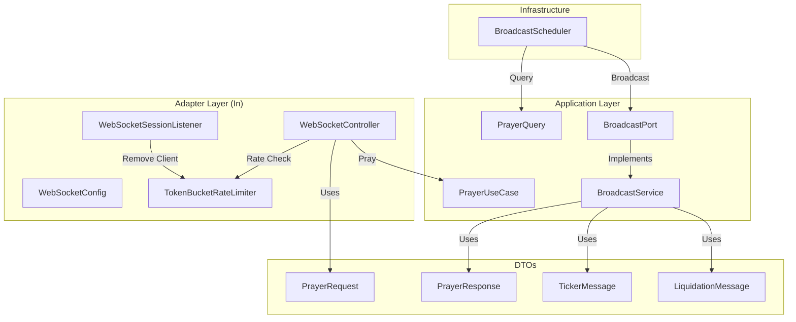
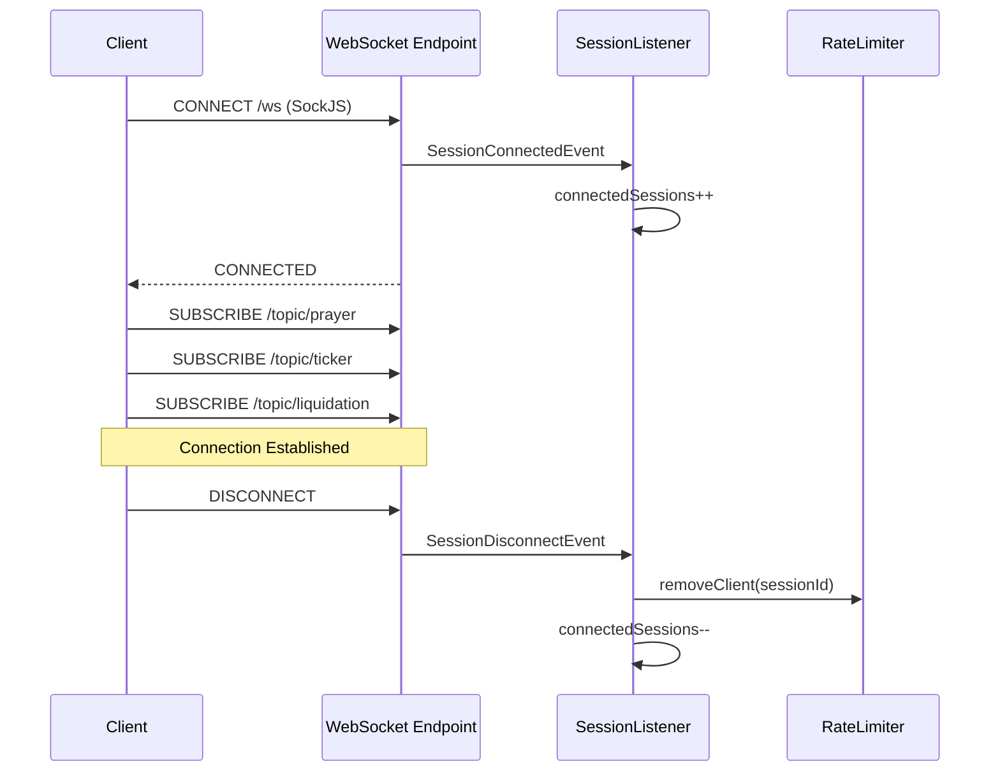
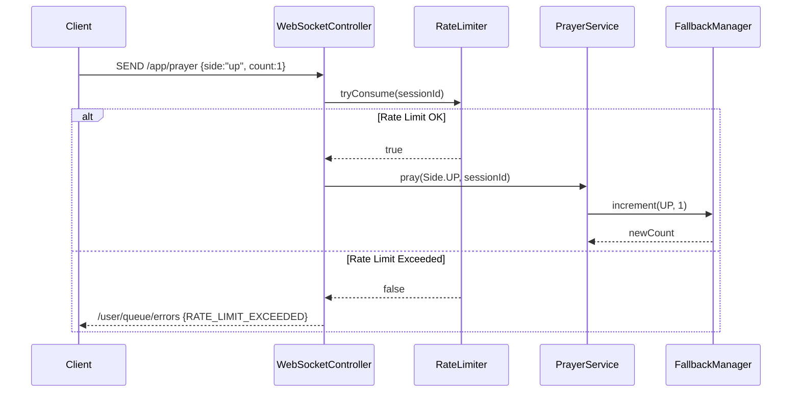
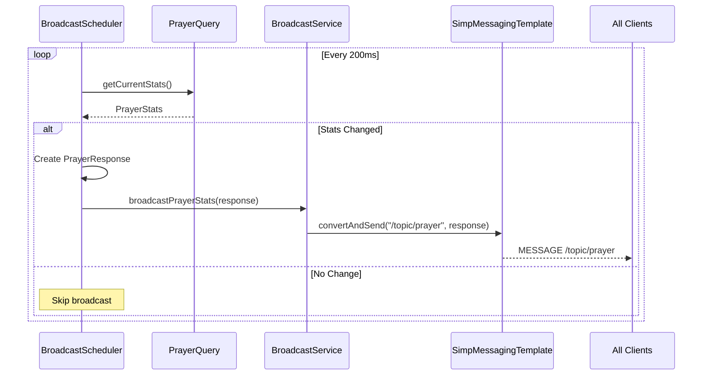
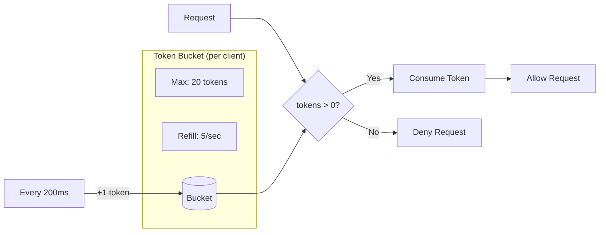
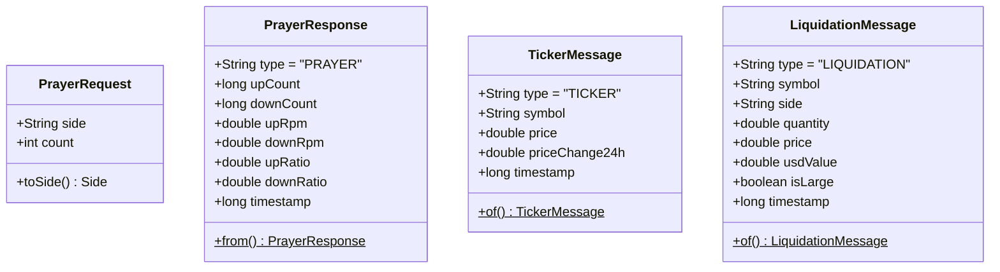

# Phase 2b: Backend WebSocket & STOMP 다이어그램

## 1. 컴포넌트 관계도



## 2. WebSocket 연결 흐름



## 3. 기도 요청 처리 흐름



## 4. 브로드캐스트 스케줄러 흐름



## 5. Rate Limiter 토큰 버킷



## 6. 에러 처리 흐름

```mermaid
flowchart TD
    REQ[Prayer Request] --> RL{Rate Limit Check}
    RL -->|Pass| SIDE{Valid Side?}
    RL -->|Fail| RLERR[RateLimitExceededException]
    RLERR --> HANDLER[@MessageExceptionHandler]
    HANDLER --> QUEUE["/user/queue/errors"]

    SIDE -->|Valid| PROCESS[Process Prayer]
    SIDE -->|Invalid| ILLERR[IllegalArgumentException]
    ILLERR --> LOG[Log Error]
```

## 7. DTO 구조


