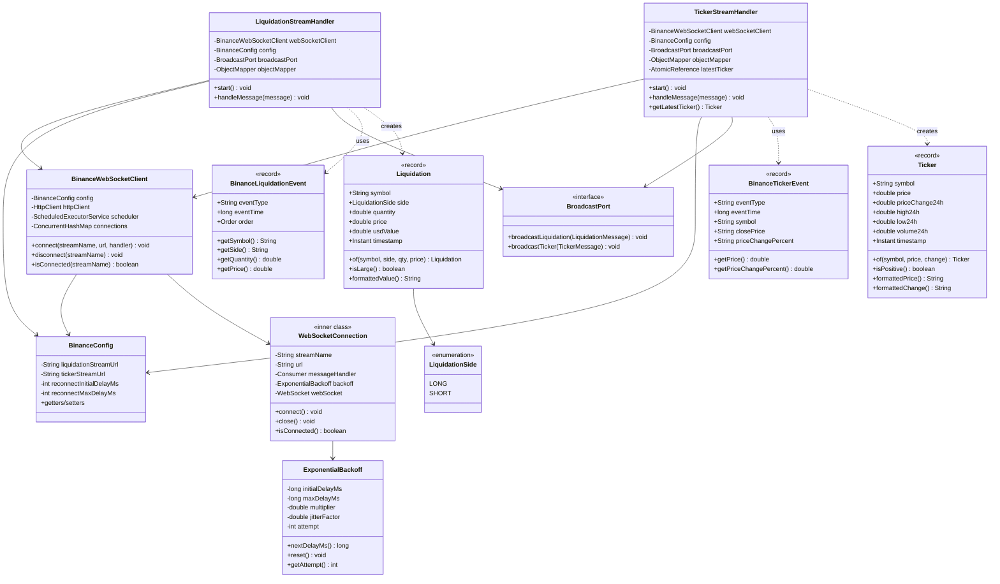
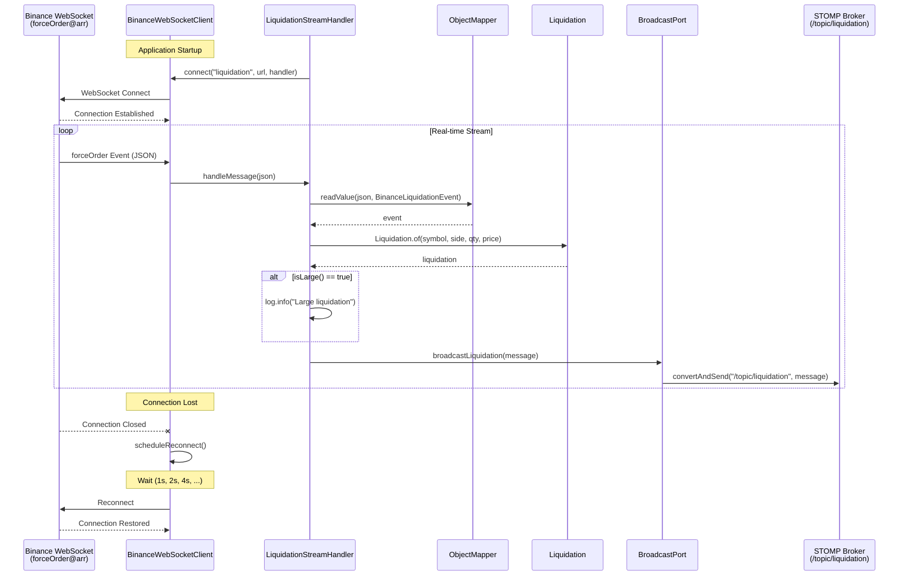
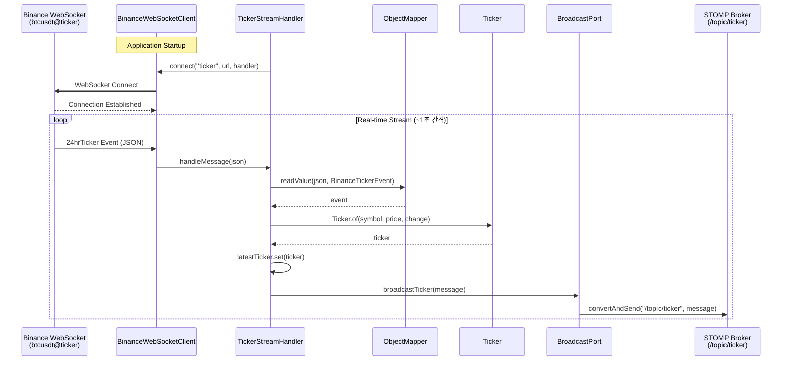
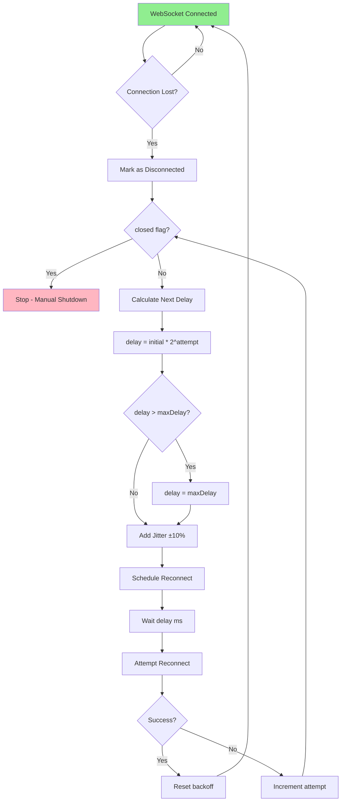
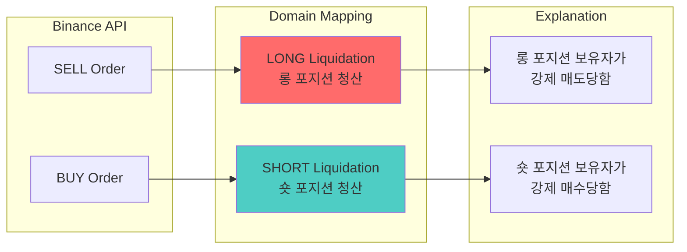
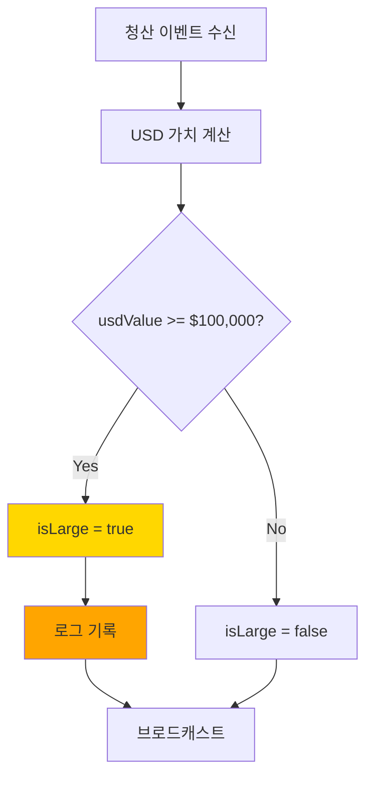

# Phase 3: Binance Integration - 다이어그램

## 1. 컴포넌트 관계도



## 2. 청산 스트림 시퀀스 다이어그램



## 3. 시세 스트림 시퀀스 다이어그램



## 4. 재연결 전략 플로우차트



## 5. 데이터 변환 플로우

```mermaid
flowchart LR
    subgraph Binance
        B1[forceOrder JSON]
        B2[24hrTicker JSON]
    end

    subgraph DTO Layer
        D1[BinanceLiquidationEvent]
        D2[BinanceTickerEvent]
    end

    subgraph Domain Layer
        M1[Liquidation]
        M2[Ticker]
    end

    subgraph Broadcast Layer
        C1[LiquidationMessage]
        C2[TickerMessage]
    end

    subgraph Client
        W1[WebSocket /topic/liquidation]
        W2[WebSocket /topic/ticker]
    end

    B1 -->|Jackson| D1
    B2 -->|Jackson| D2
    D1 -->|of()| M1
    D2 -->|of()| M2
    M1 -->|convert| C1
    M2 -->|convert| C2
    C1 -->|STOMP| W1
    C2 -->|STOMP| W2
```

## 6. 청산 방향 변환 로직



## 7. 대형 청산 감지



## 8. 전체 아키텍처 컨텍스트

```mermaid
flowchart TB
    subgraph External
        BIN[Binance Futures API]
    end

    subgraph Backend
        subgraph Adapter Layer
            WSC[BinanceWebSocketClient]
            LSH[LiquidationStreamHandler]
            TSH[TickerStreamHandler]
        end

        subgraph Domain Layer
            LIQ[Liquidation Model]
            TIC[Ticker Model]
        end

        subgraph Application Layer
            BP[BroadcastPort]
            BS[BroadcastService]
        end

        subgraph Infrastructure
            STOMP[STOMP Broker]
        end
    end

    subgraph Frontend
        WS[WebSocket Client]
        UI[React UI]
    end

    BIN -->|forceOrder| WSC
    BIN -->|btcusdt@ticker| WSC

    WSC --> LSH
    WSC --> TSH

    LSH --> LIQ
    TSH --> TIC

    LIQ --> BP
    TIC --> BP

    BP --> BS
    BS --> STOMP

    STOMP -->|/topic/liquidation| WS
    STOMP -->|/topic/ticker| WS

    WS --> UI
```
