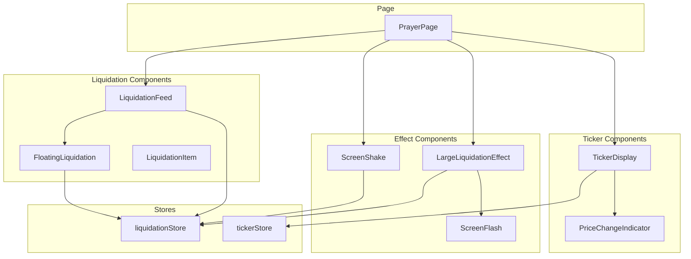
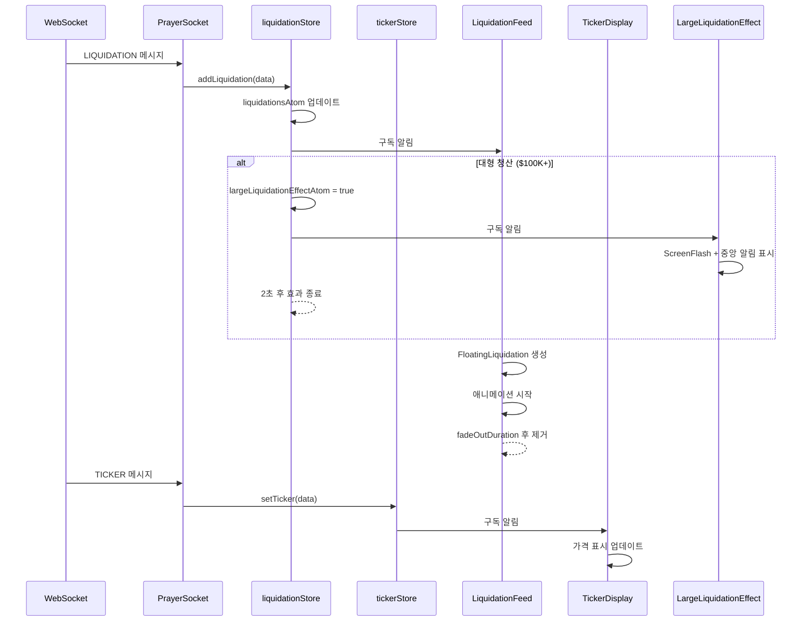
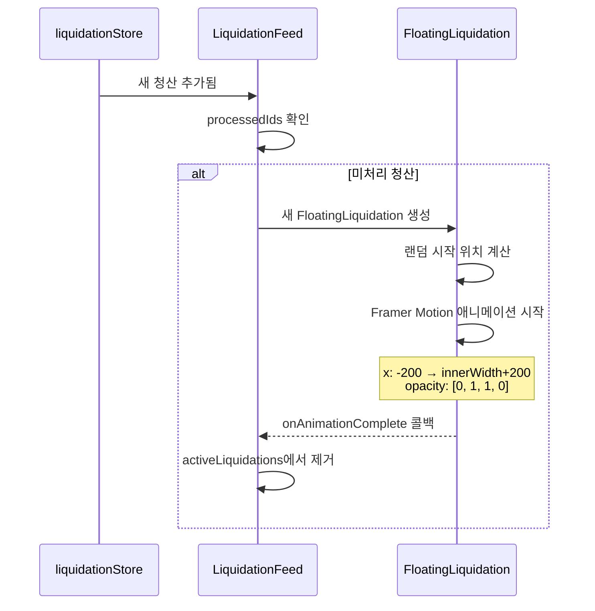
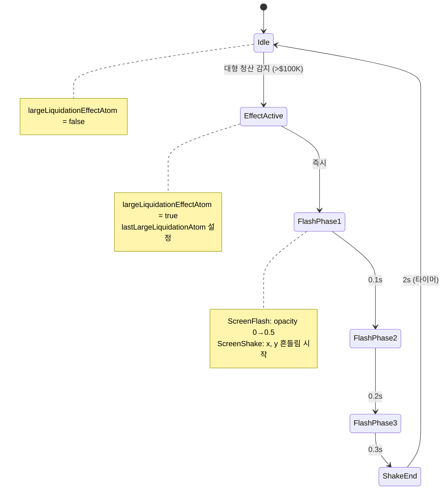
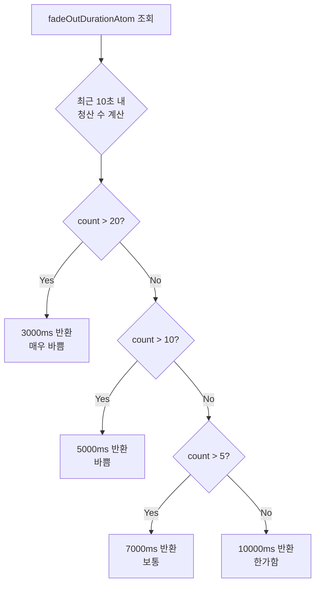
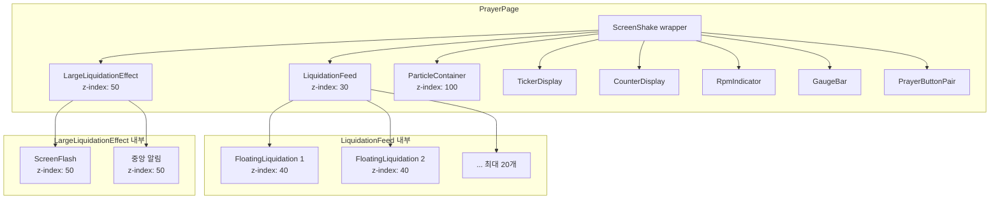
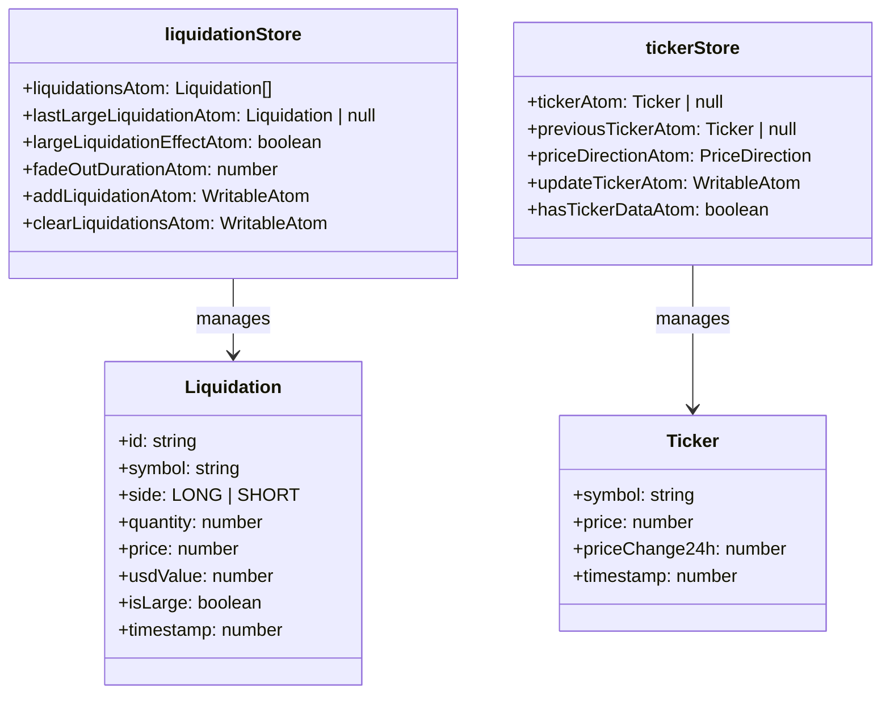

# Phase 5b: UI 청산 피드 & 효과 - 다이어그램

## 컴포넌트 관계도

```mermaid
graph TB
    subgraph Stores
        LS[liquidationStore]
        TS[tickerStore]
    end

    subgraph "Liquidation Components"
        LF[LiquidationFeed]
        FL[FloatingLiquidation]
        LI[LiquidationItem]
    end

    subgraph "Effect Components"
        LLE[LargeLiquidationEffect]
        SF[ScreenFlash]
        SS[ScreenShake]
    end

    subgraph "Ticker Components"
        TD[TickerDisplay]
        PCI[PriceChangeIndicator]
    end

    subgraph Page
        PP[PrayerPage]
    end

    PP --> LF
    PP --> LLE
    PP --> SS
    PP --> TD

    LF --> FL
    LF --> LS

    FL --> LS

    LLE --> SF
    LLE --> LS

    TD --> TS
    TD --> PCI

    SS --> LS
```

## 데이터 흐름 다이어그램

```mermaid
sequenceDiagram
    participant WS as WebSocket
    participant PS as PrayerSocket
    participant LS as liquidationStore
    participant TS as tickerStore
    participant LF as LiquidationFeed
    participant TD as TickerDisplay
    participant LLE as LargeLiquidationEffect

    WS->>PS: LIQUIDATION 메시지
    PS->>LS: addLiquidation(data)
    LS->>LS: liquidationsAtom 업데이트
    LS->>LF: 구독 알림

    alt 대형 청산 ($100K+)
        LS->>LS: largeLiquidationEffectAtom = true
        LS->>LLE: 구독 알림
        LLE->>LLE: ScreenFlash + 중앙 알림 표시
        LS-->>LS: 2초 후 효과 종료
    end

    LF->>LF: FloatingLiquidation 생성
    LF->>LF: 애니메이션 시작
    LF-->>LF: fadeOutDuration 후 제거

    WS->>PS: TICKER 메시지
    PS->>TS: setTicker(data)
    TS->>TD: 구독 알림
    TD->>TD: 가격 표시 업데이트
```

## 청산 애니메이션 시퀀스

```mermaid
sequenceDiagram
    participant LS as liquidationStore
    participant LF as LiquidationFeed
    participant FL as FloatingLiquidation

    LS->>LF: 새 청산 추가됨
    LF->>LF: processedIds 확인

    alt 미처리 청산
        LF->>FL: 새 FloatingLiquidation 생성
        FL->>FL: 랜덤 시작 위치 계산
        FL->>FL: Framer Motion 애니메이션 시작
        Note over FL: x: -200 → innerWidth+200<br/>opacity: [0, 1, 1, 0]
        FL-->>LF: onAnimationComplete 콜백
        LF->>LF: activeLiquidations에서 제거
    end
```

## 대형 청산 효과 상태 다이어그램

```mermaid
stateDiagram-v2
    [*] --> Idle

    Idle --> EffectActive: 대형 청산 감지 (>$100K)
    EffectActive --> FlashPhase1: 즉시
    FlashPhase1 --> FlashPhase2: 0.1s
    FlashPhase2 --> FlashPhase3: 0.2s
    FlashPhase3 --> ShakeEnd: 0.3s
    ShakeEnd --> Idle: 2s (타이머)

    note right of EffectActive
        largeLiquidationEffectAtom = true
        lastLargeLiquidationAtom 설정
    end note

    note right of FlashPhase1
        ScreenFlash: opacity 0→0.5
        ScreenShake: x, y 흔들림 시작
    end note

    note right of Idle
        largeLiquidationEffectAtom = false
    end note
```

## 동적 Fade-out 결정 로직

```mermaid
flowchart TD
    A[fadeOutDurationAtom 조회] --> B{최근 10초 내<br/>청산 수 계산}
    B --> C{count > 20?}
    C -->|Yes| D[3000ms 반환<br/>매우 바쁨]
    C -->|No| E{count > 10?}
    E -->|Yes| F[5000ms 반환<br/>바쁨]
    E -->|No| G{count > 5?}
    G -->|Yes| H[7000ms 반환<br/>보통]
    G -->|No| I[10000ms 반환<br/>한가함]
```

## 컴포넌트 계층 구조

```mermaid
graph TD
    subgraph "PrayerPage"
        A[ScreenShake wrapper]
        A --> B[LiquidationFeed<br/>z-index: 30]
        A --> C[LargeLiquidationEffect<br/>z-index: 50]
        A --> D[ParticleContainer<br/>z-index: 100]
        A --> E[TickerDisplay]
        A --> F[CounterDisplay]
        A --> G[RpmIndicator]
        A --> H[GaugeBar]
        A --> I[PrayerButtonPair]
    end

    subgraph "LiquidationFeed 내부"
        B --> B1[FloatingLiquidation 1<br/>z-index: 40]
        B --> B2[FloatingLiquidation 2<br/>z-index: 40]
        B --> B3[... 최대 20개]
    end

    subgraph "LargeLiquidationEffect 내부"
        C --> C1[ScreenFlash<br/>z-index: 50]
        C --> C2[중앙 알림<br/>z-index: 50]
    end
```

## Store 관계도

```mermaid
classDiagram
    class liquidationStore {
        +liquidationsAtom: Liquidation[]
        +lastLargeLiquidationAtom: Liquidation | null
        +largeLiquidationEffectAtom: boolean
        +fadeOutDurationAtom: number
        +addLiquidationAtom: WritableAtom
        +clearLiquidationsAtom: WritableAtom
    }

    class tickerStore {
        +tickerAtom: Ticker | null
        +previousTickerAtom: Ticker | null
        +priceDirectionAtom: PriceDirection
        +updateTickerAtom: WritableAtom
        +hasTickerDataAtom: boolean
    }

    class Liquidation {
        +id: string
        +symbol: string
        +side: LONG | SHORT
        +quantity: number
        +price: number
        +usdValue: number
        +isLarge: boolean
        +timestamp: number
    }

    class Ticker {
        +symbol: string
        +price: number
        +priceChange24h: number
        +timestamp: number
    }

    liquidationStore --> Liquidation : manages
    tickerStore --> Ticker : manages
```
