# Phase 2a 데이터 흐름 다이어그램 (Mermaid)

> 작성일: 2026-01-20
> 형식: Mermaid (GitHub, Notion 렌더링 지원)

---

## 목차

1. [아키텍처 레이어](#1-아키텍처-레이어)
2. [컴포넌트 관계도](#2-컴포넌트-관계도)
3. [시퀀스 다이어그램](#3-시퀀스-다이어그램)
4. [상태 다이어그램](#4-상태-다이어그램)
5. [코드 위치 참조](#5-코드-위치-참조)

---

## 1. 아키텍처 레이어

### 헥사고날 아키텍처 구조

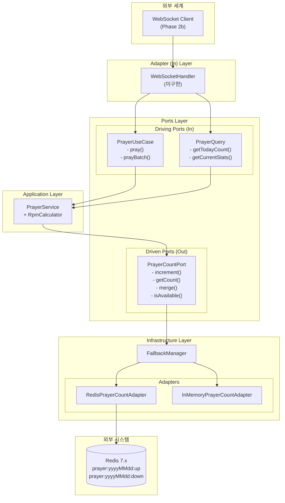

---

## 2. 컴포넌트 관계도

### 클래스 의존성

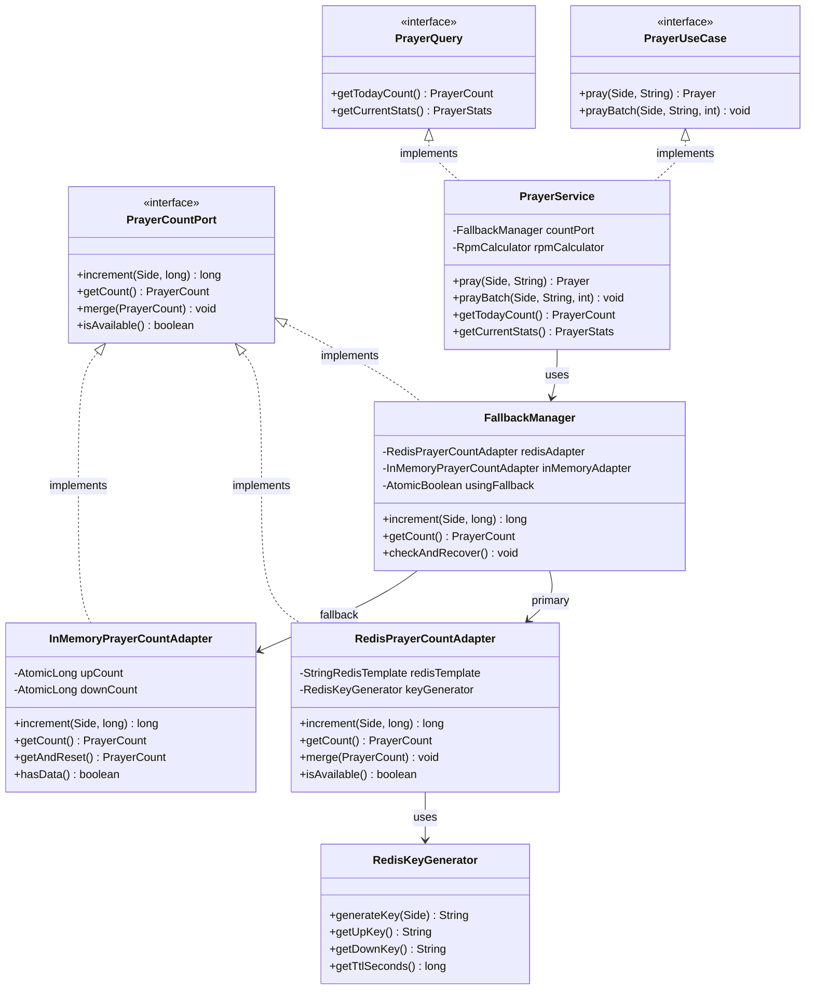

### 도메인 모델

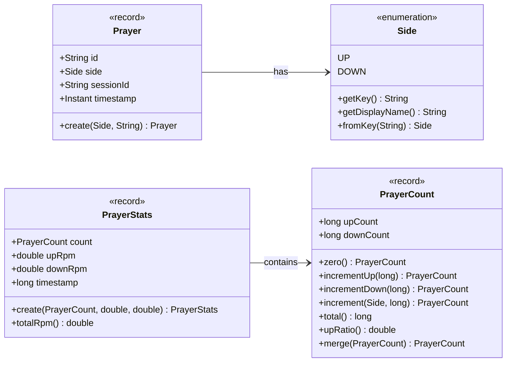

---

## 3. 시퀀스 다이어그램

### Flow 1: 단일 기도 등록 (pray)

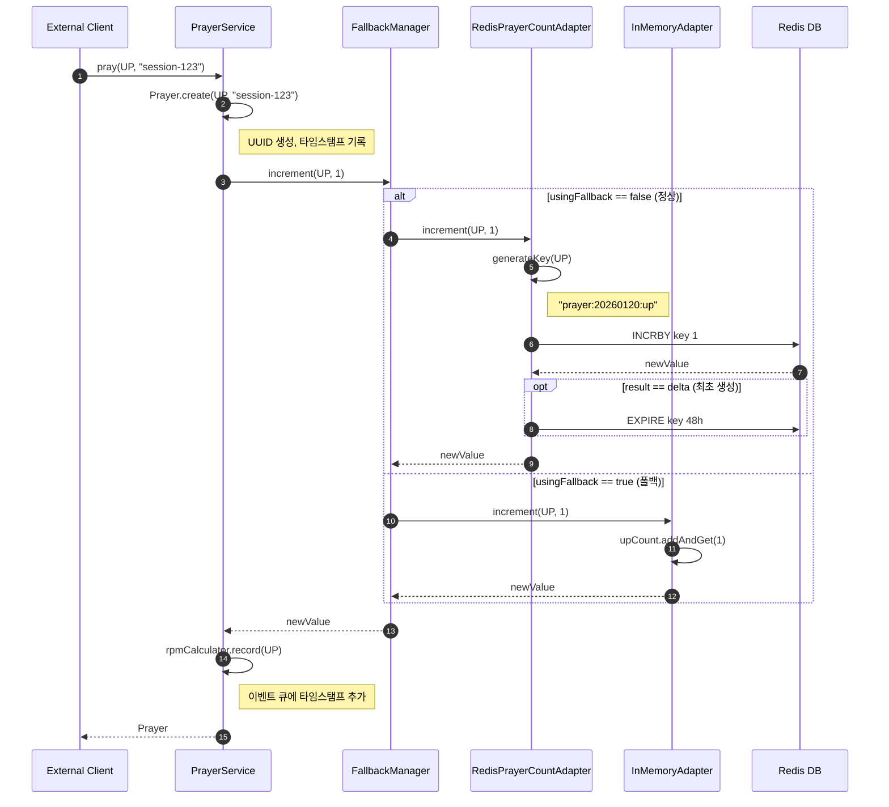

### Flow 2: 배치 기도 등록 (prayBatch)

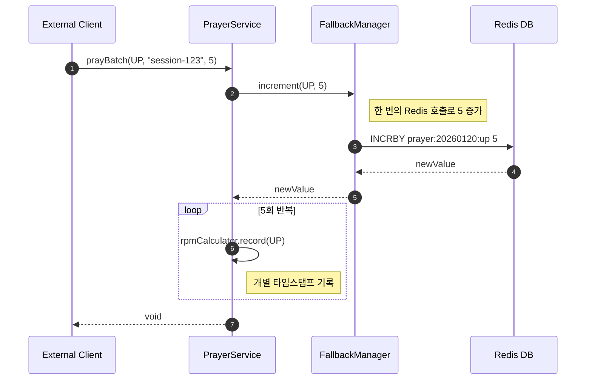

### Flow 3: 카운트 조회 (getTodayCount)

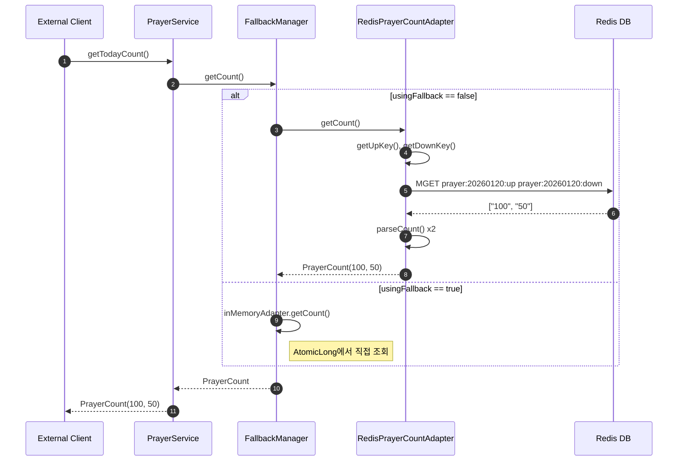

### Flow 4: 통계 조회 (getCurrentStats)

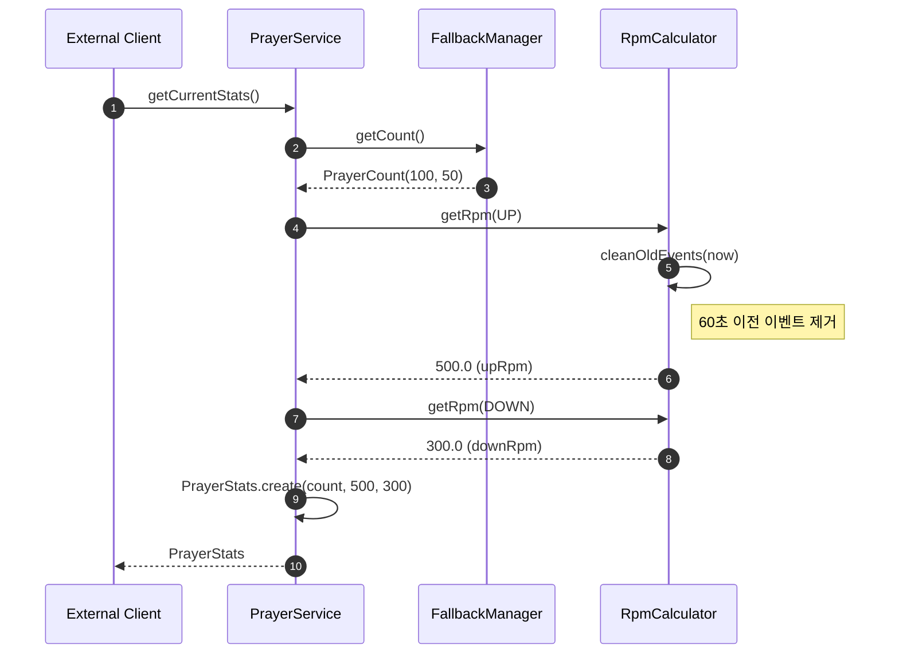

### Flow 5: 폴백 복구 (checkAndRecover)

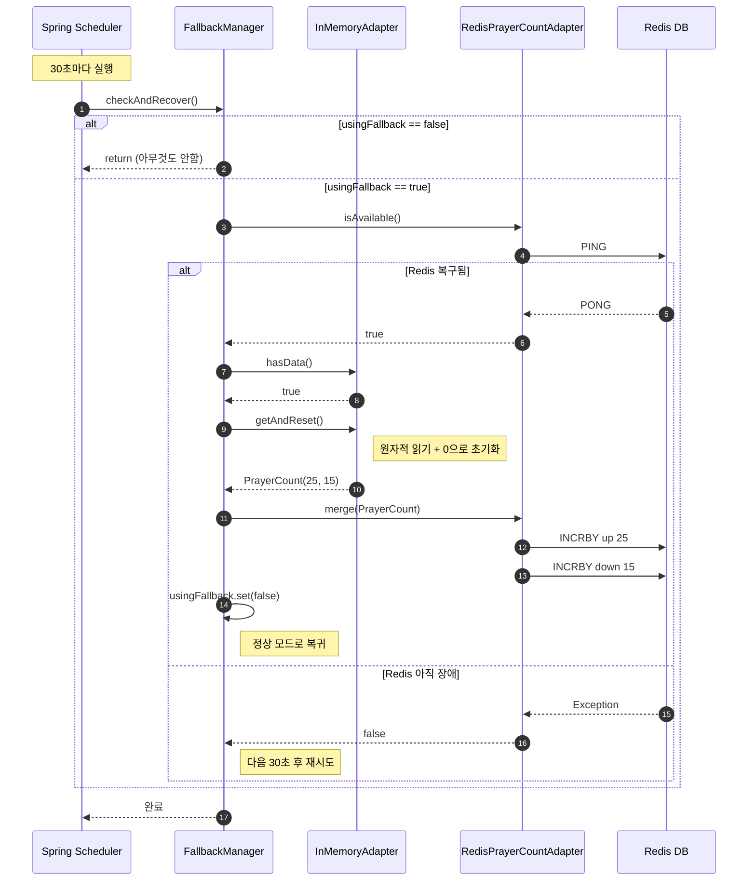

---

## 4. 상태 다이어그램

### 폴백 상태 전이

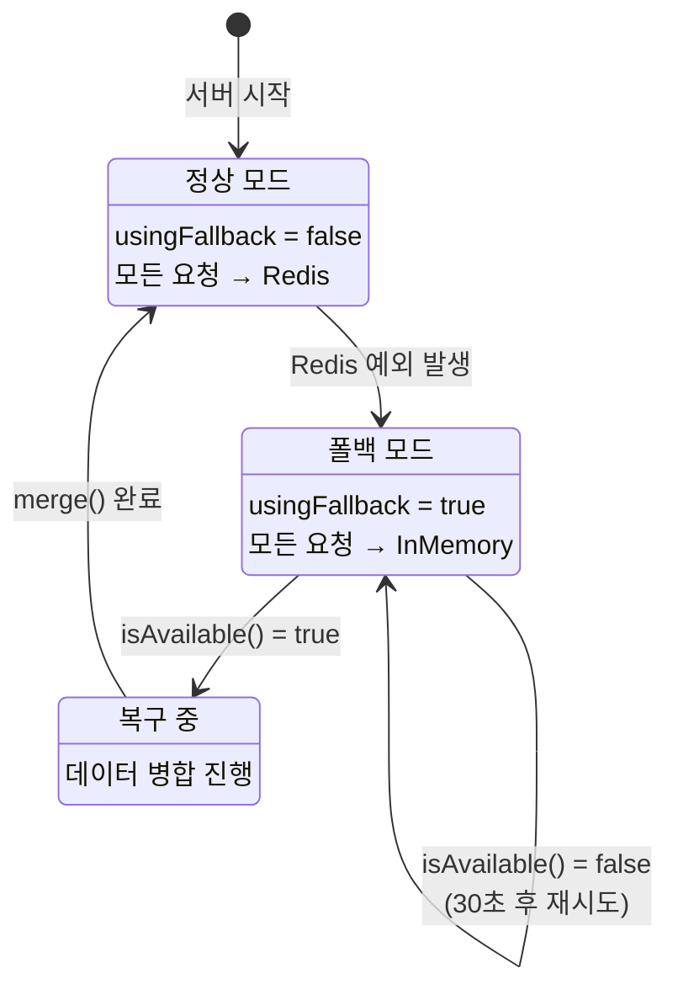

### 장애 시나리오 타임라인

```mermaid
gantt
    title 폴백 시나리오 타임라인
    dateFormat ss
    axisFormat %S초

    section 정상 상태
    Redis 처리     :normal1, 00, 3s

    section 장애 발생
    Redis 장애!     :crit, fault, after normal1, 1s
    폴백 전환       :milestone, after fault, 0s

    section 폴백 모드
    InMemory 처리   :fallback, after fault, 27s
    복구 시도 (실패) :milestone, 30, 0s
    InMemory 계속   :fallback2, 30, 30s
    복구 시도 (실패) :milestone, 60, 0s

    section 복구
    Redis 복구됨    :milestone, 65, 0s
    복구 시도 (성공) :done, recover, 90, 1s
    데이터 병합     :done, merge, after recover, 1s

    section 정상 복귀
    Redis 처리     :normal2, after merge, 10s
```

---

## 5. 코드 위치 참조

### 파일별 핵심 메서드

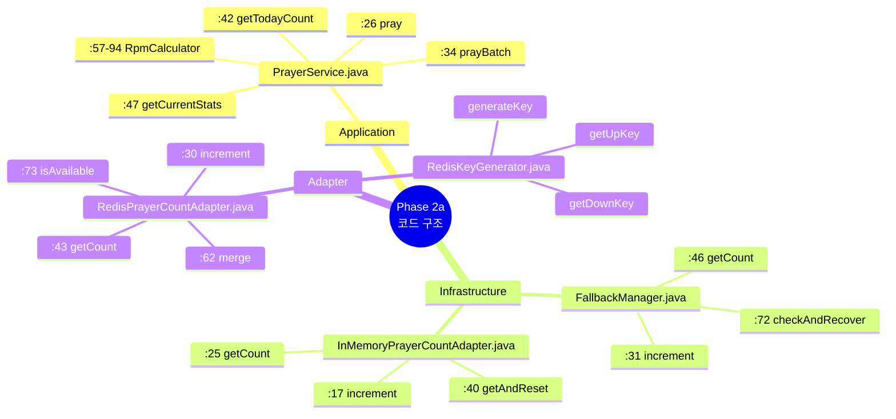

### 포트 인터페이스 위치

| 포트 | 파일 경로 | 방향 |
|------|-----------|------|
| `PrayerUseCase` | `application/port/in/PrayerUseCase.java` | Driving (In) |
| `PrayerQuery` | `application/port/in/PrayerQuery.java` | Driving (In) |
| `PrayerCountPort` | `application/port/out/PrayerCountPort.java` | Driven (Out) |

### 도메인 모델 위치

| 모델 | 파일 경로 | 설명 |
|------|-----------|------|
| `Side` | `domain/model/Side.java` | UP/DOWN enum |
| `Prayer` | `domain/model/Prayer.java` | 기도 액션 record |
| `PrayerCount` | `domain/model/PrayerCount.java` | 카운트 Value Object |
| `PrayerStats` | `domain/model/PrayerStats.java` | 통계 Value Object |

---

## 요약

이 다이어그램 문서는 Phase 2a에서 구현된 코드의 구조와 데이터 흐름을 Mermaid로 시각화합니다:

1. **아키텍처 레이어**: 헥사고날 아키텍처의 각 레이어 구성
2. **컴포넌트 관계도**: 클래스/인터페이스 의존성 및 도메인 모델
3. **시퀀스 다이어그램**: 5개 주요 유스케이스의 호출 흐름
4. **상태 다이어그램**: 폴백 모드 전이 및 복구 시나리오

다음 Phase 2b에서 WebSocket Handler가 추가되면 시퀀스 다이어그램의 진입점이 완성됩니다.
