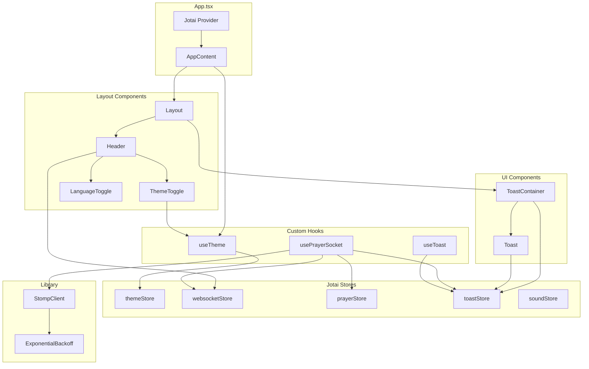
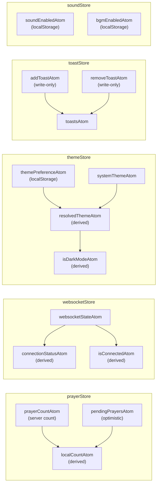
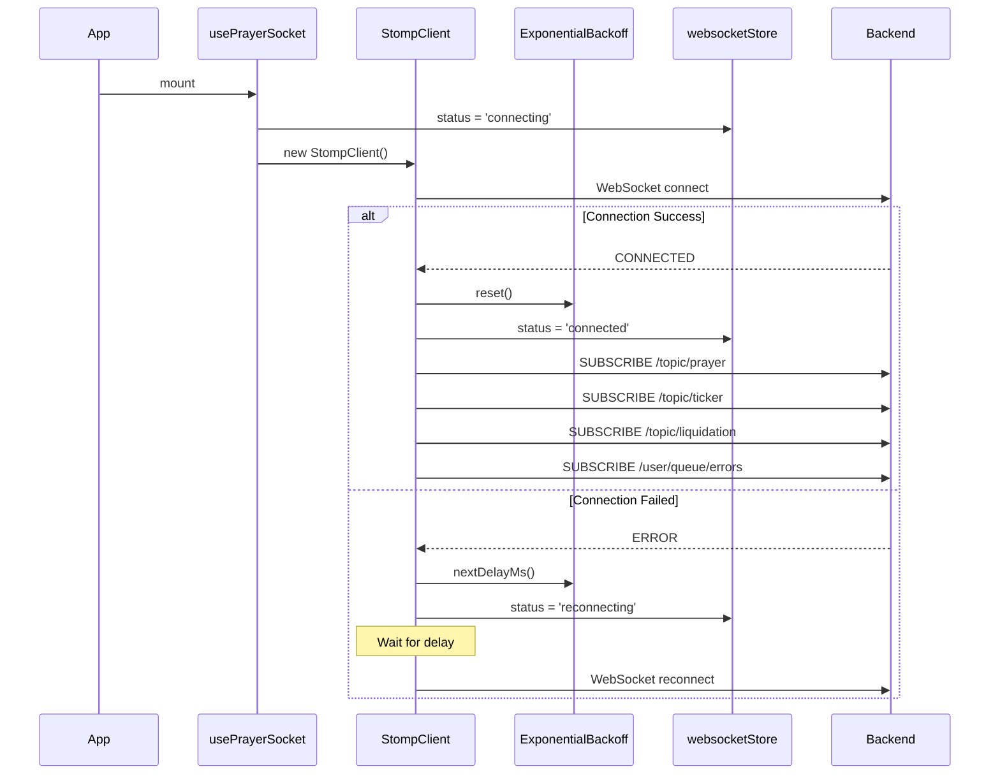
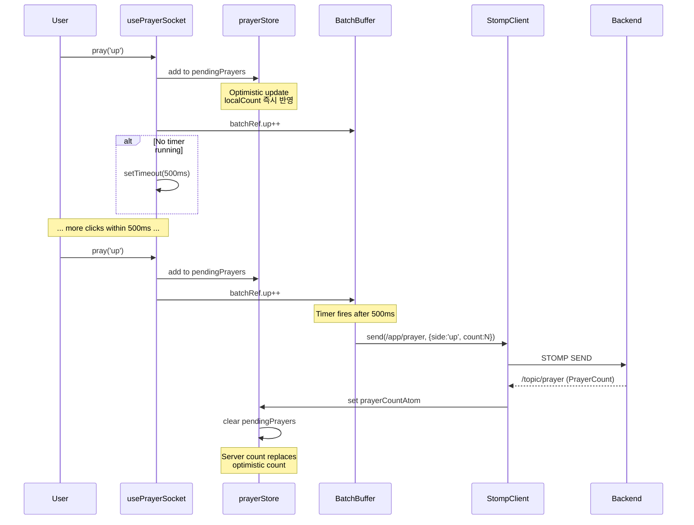
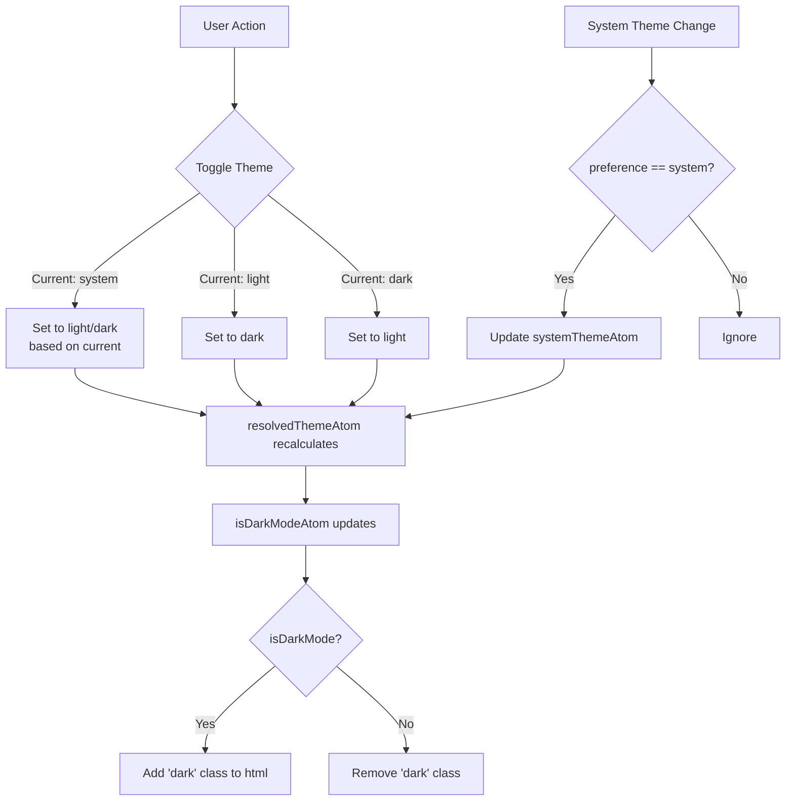
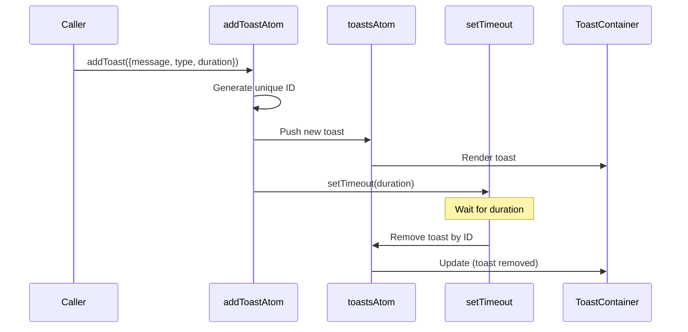
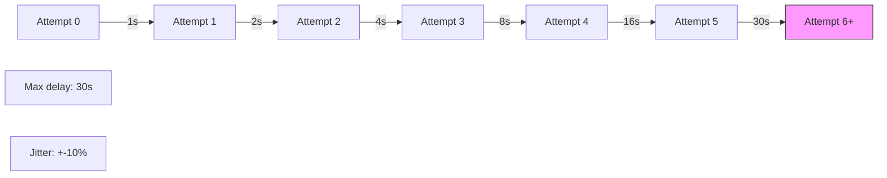
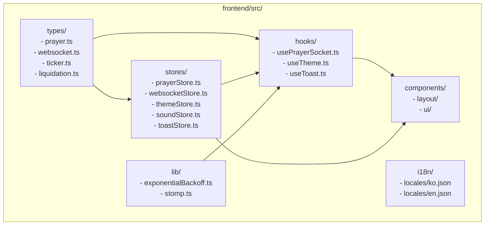

# Phase 4: Frontend Core - 아키텍처 다이어그램

## 1. 컴포넌트 의존성 다이어그램

## 2. Jotai 스토어 구조

## 3. WebSocket 연결 시퀀스

## 4. 기도 클릭 시퀀스 (배칭 + 낙관적 업데이트)

## 5. 테마 시스템 흐름

## 6. 토스트 알림 시퀀스

## 7. Exponential Backoff 알고리즘

## 8. 디렉토리 구조

