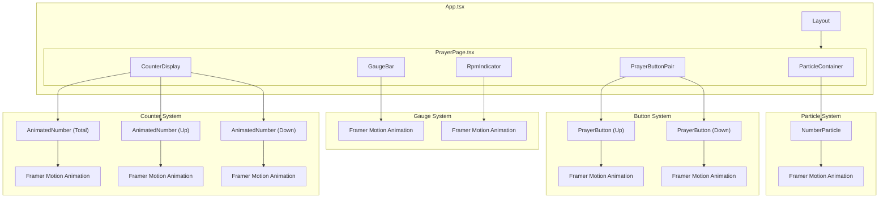
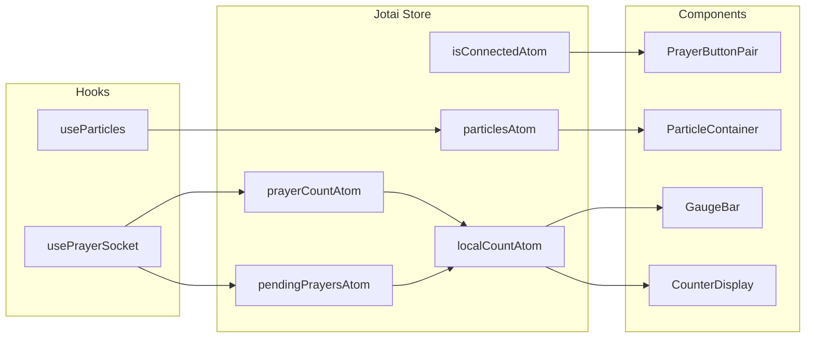
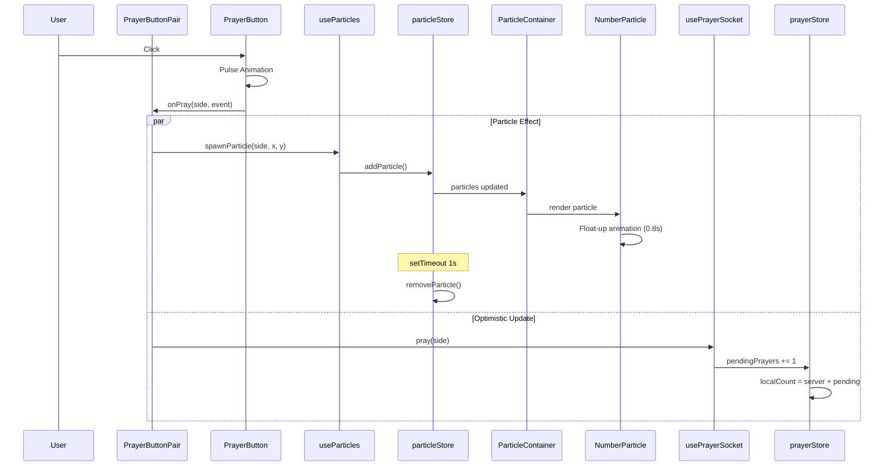
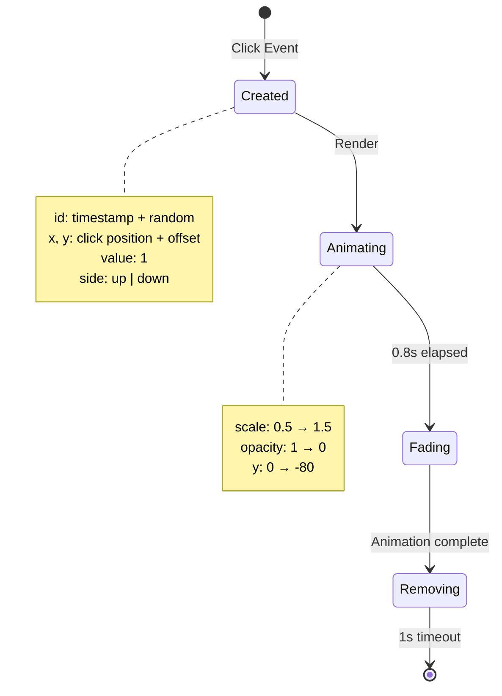
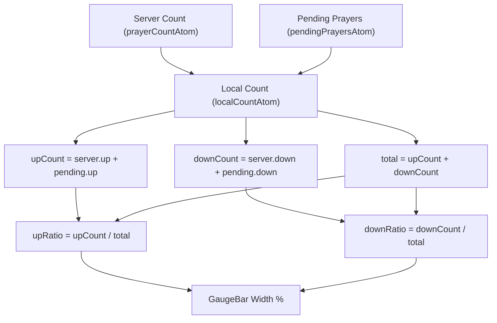
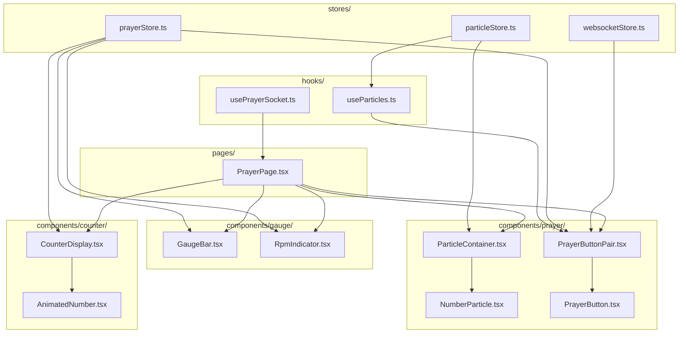
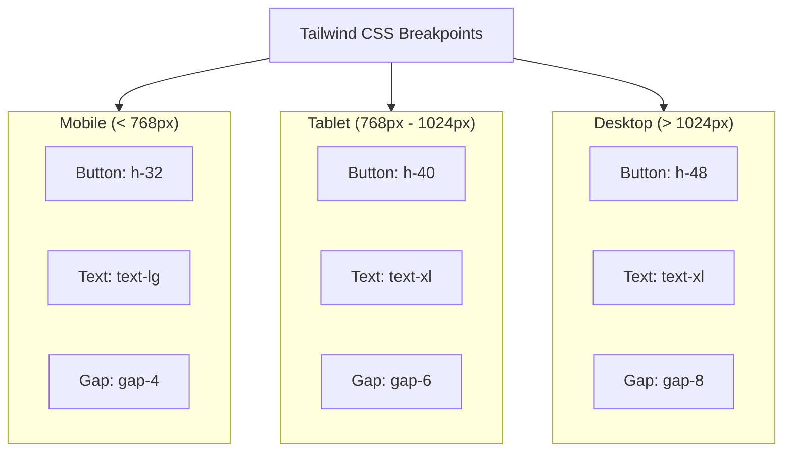
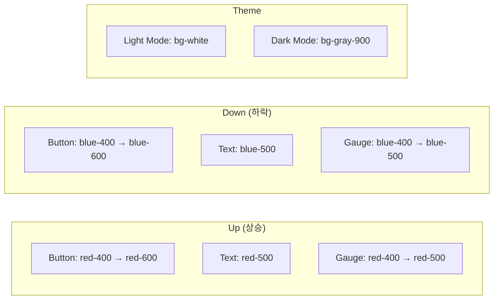
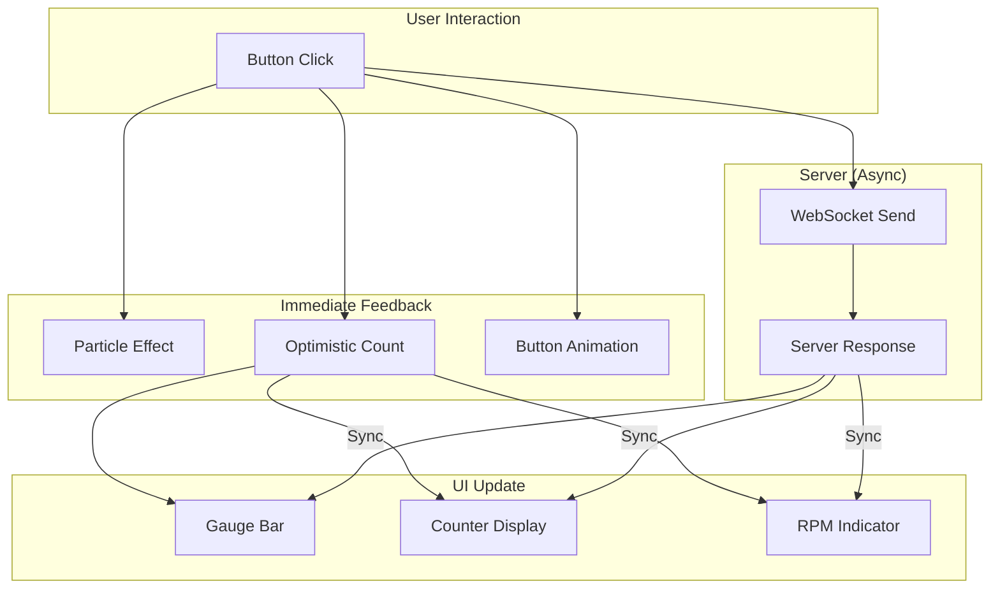

# Phase 5a: UI 기도 버튼 & 게이지 다이어그램

## 1. 컴포넌트 구조도

## 2. 상태 관리 흐름

## 3. 사용자 클릭 시퀀스

## 4. 파티클 라이프사이클

## 5. 게이지 바 비율 계산

## 6. 컴포넌트 의존성

## 7. 반응형 레이아웃

## 8. 색상 스키마

## 9. 애니메이션 타이밍

```mermaid
gantt
    title Animation Timeline
    dateFormat X
    axisFormat %L

    section Button Click
    Pulse Effect           :0, 150

    section Particle
    Scale Up (0.5→1.5)     :0, 800
    Fade Out (1→0)         :0, 800
    Float Up (0→-80)       :0, 800
    Remove from DOM        :1000, 1000

    section Gauge
    Width Transition       :0, 300

    section Counter
    Number Slide           :0, 200
```

## 10. 데이터 흐름 요약

