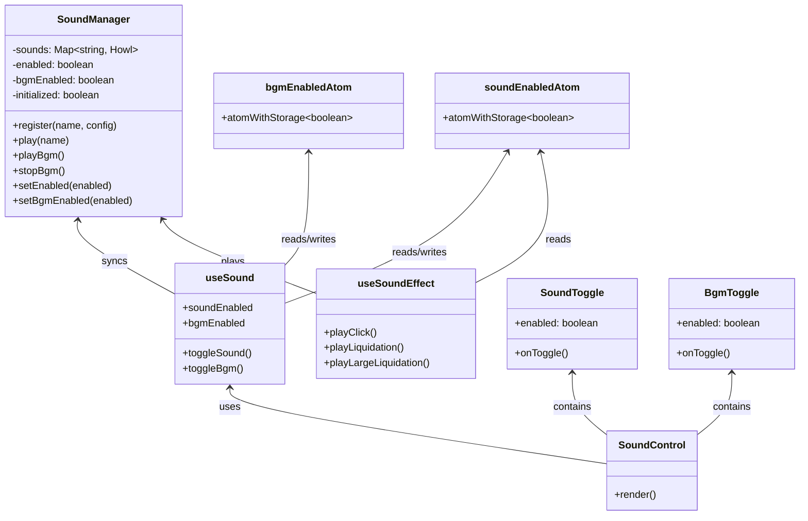
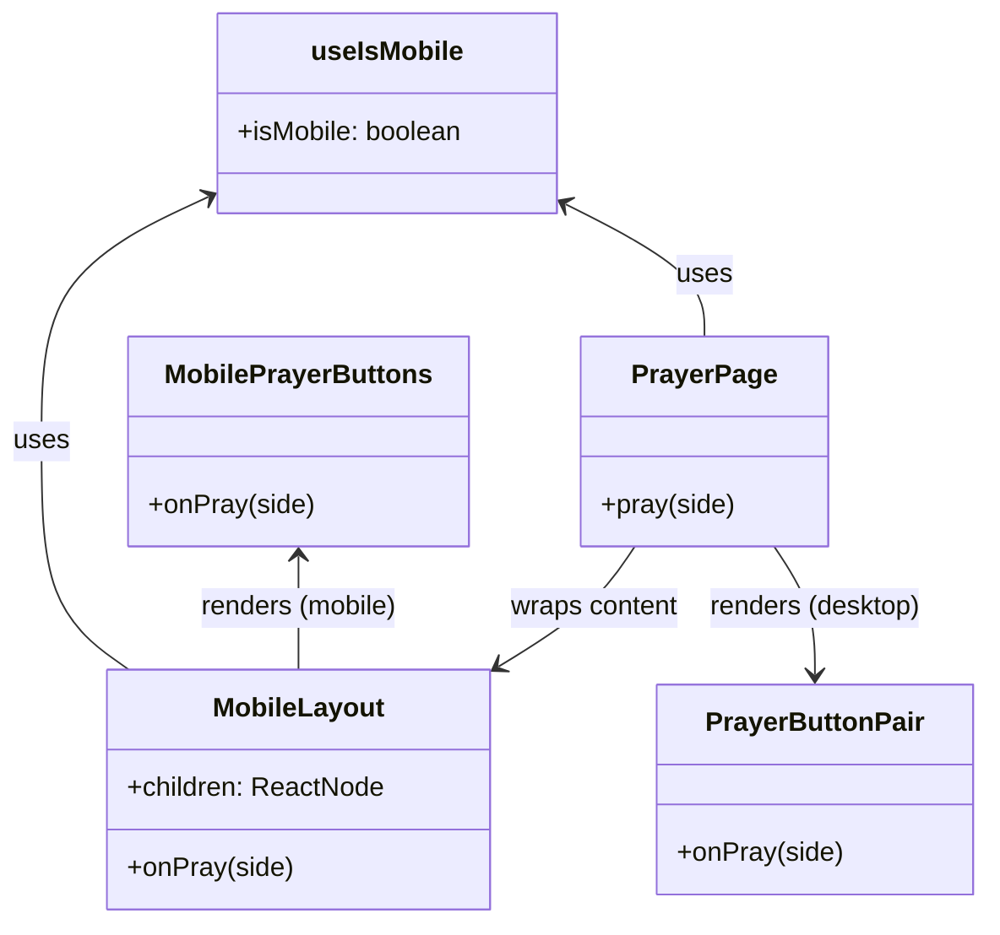
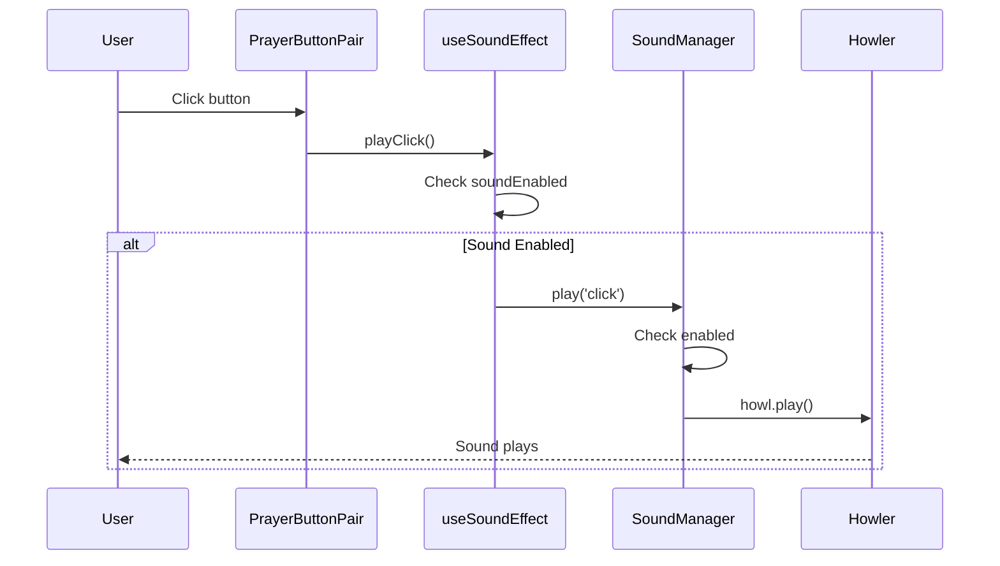
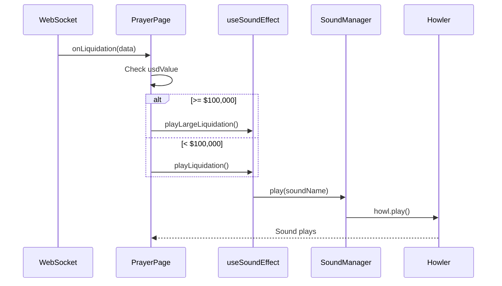
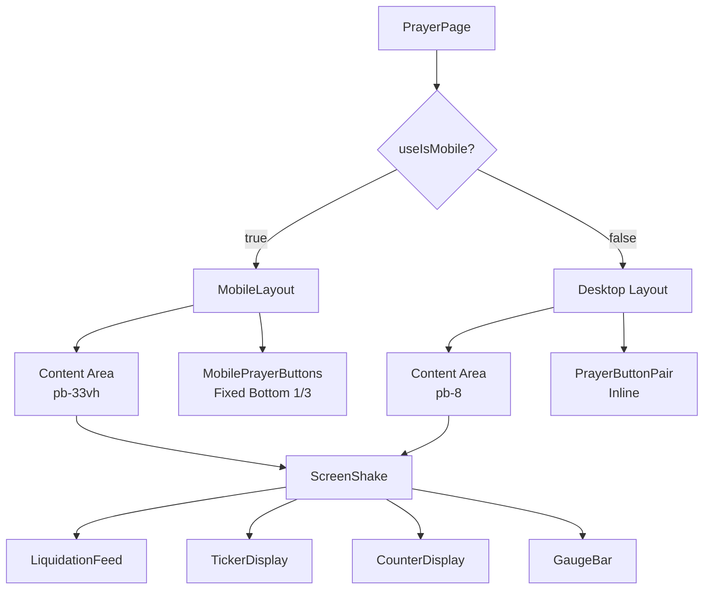
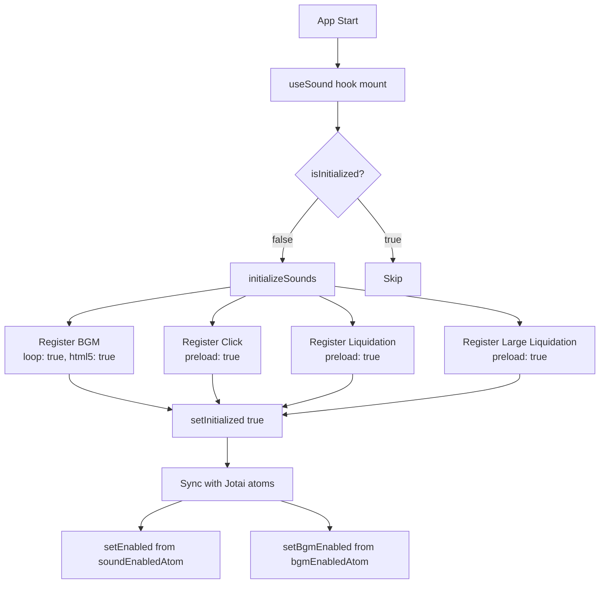
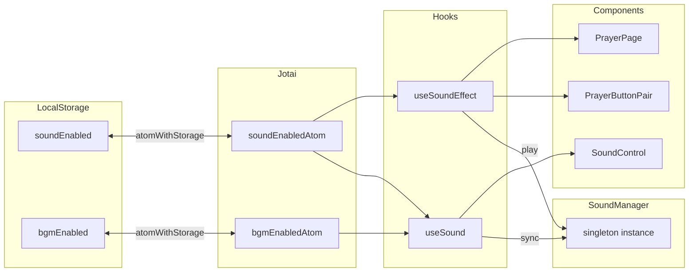
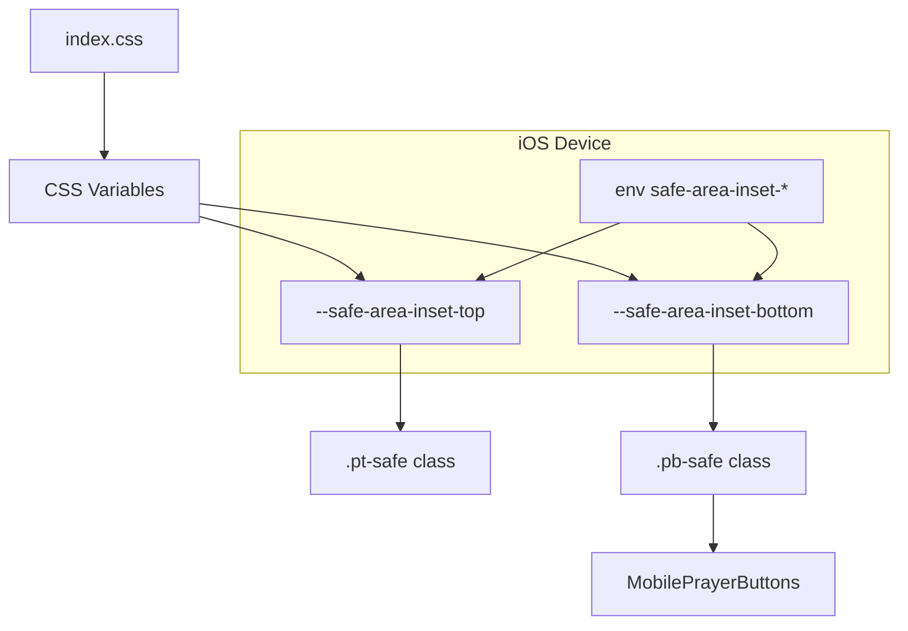

# Phase 5c: UI 사운드 & 모바일 다이어그램

## 1. 사운드 시스템 컴포넌트 관계도

## 2. 모바일 레이아웃 컴포넌트 관계도

## 3. 사운드 재생 시퀀스 다이어그램

### 3.1 클릭 사운드 재생

### 3.2 청산 사운드 재생

## 4. 모바일 레이아웃 렌더링 플로우

## 5. 사운드 초기화 플로우

## 6. 상태 관리 데이터 흐름

## 7. CSS Safe Area 적용

