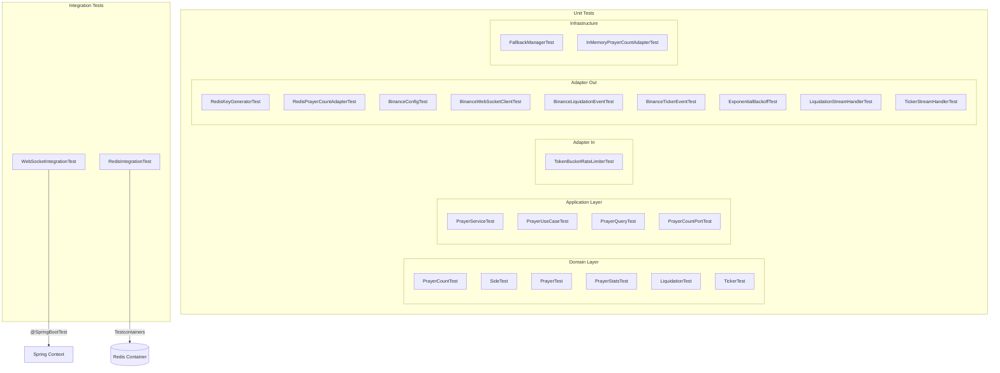
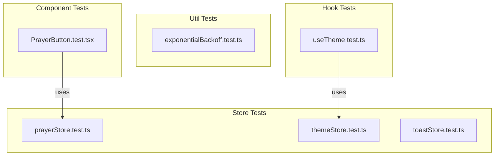
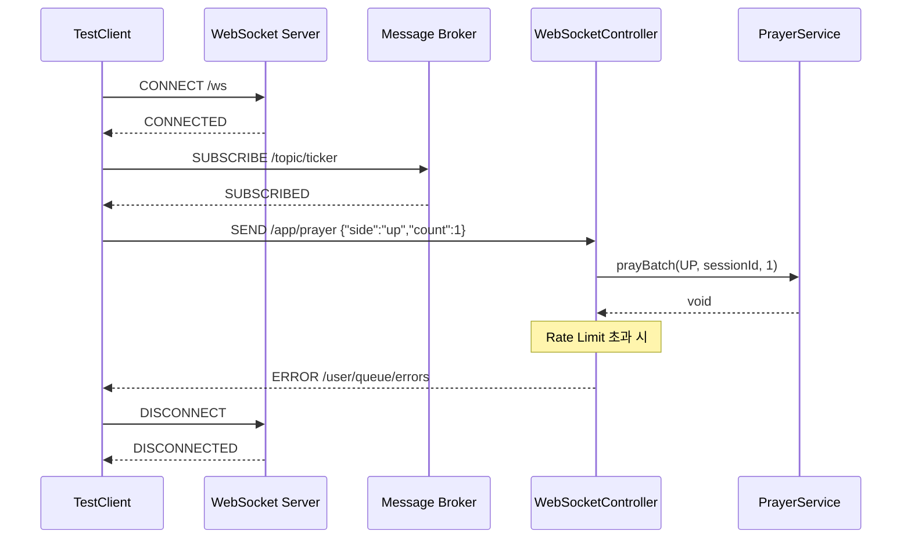
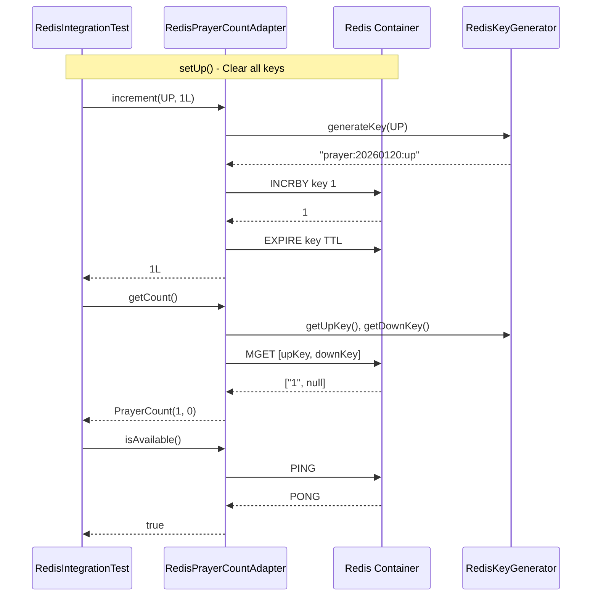
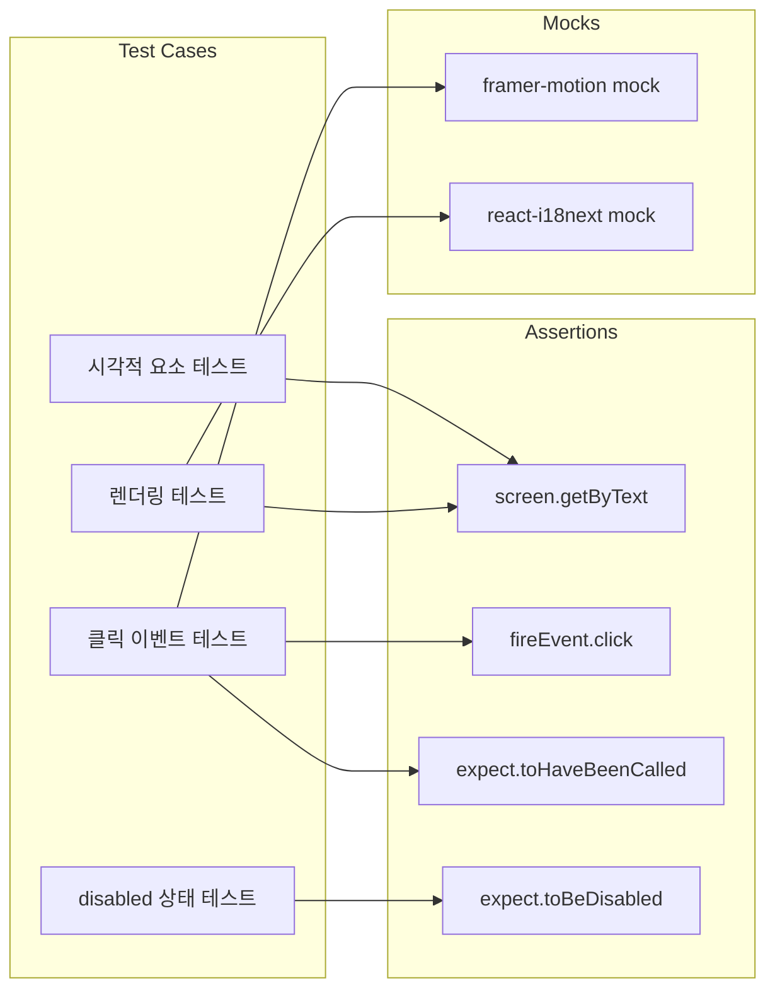
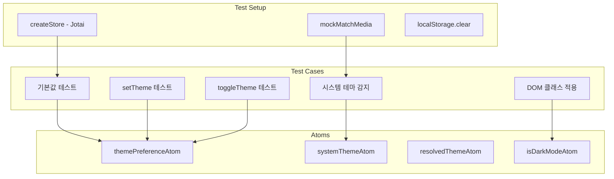
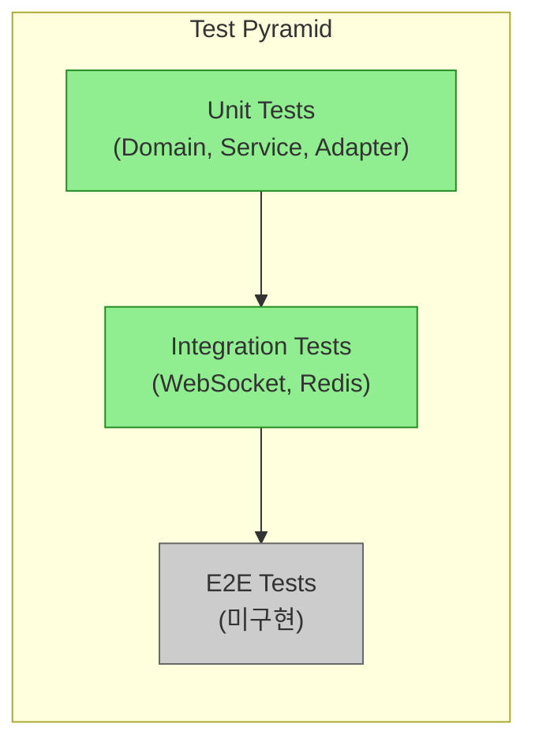
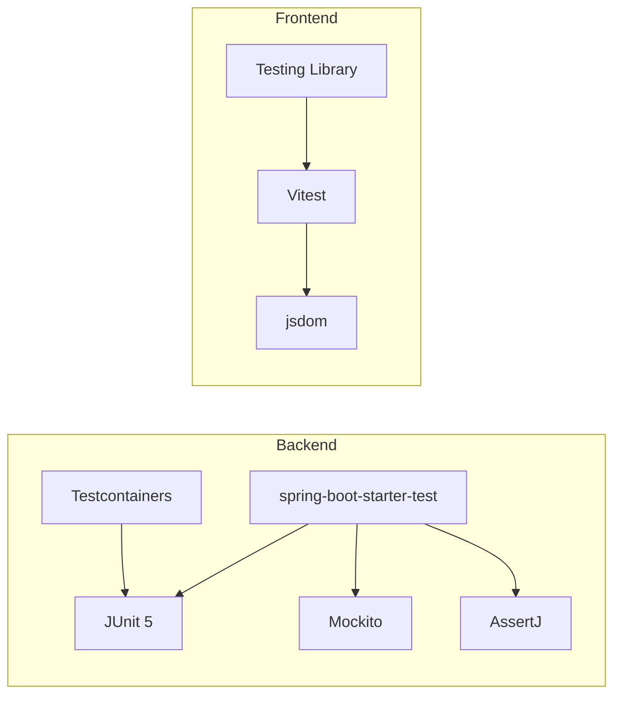

# Phase 6: 테스트 구조 다이어그램

## 1. Backend 테스트 구조

## 2. Frontend 테스트 구조

## 3. WebSocket 통합 테스트 시퀀스

## 4. Redis 통합 테스트 시퀀스

## 5. PrayerButton 컴포넌트 테스트 구조

## 6. useTheme 훅 테스트 구조

## 7. 테스트 계층 구조

## 8. 테스트 의존성 관계

