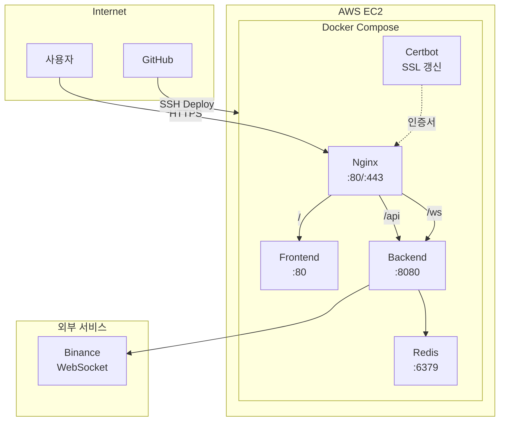
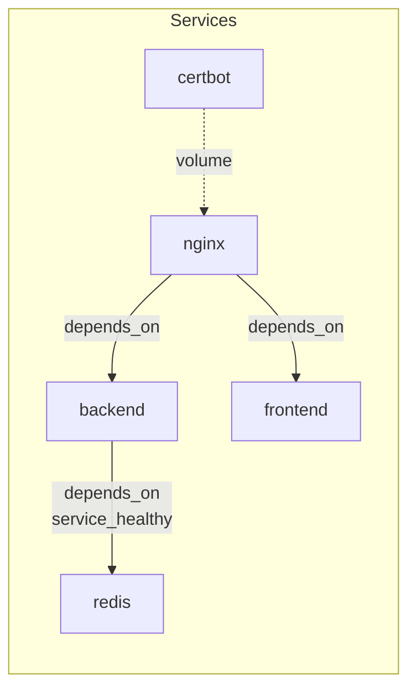
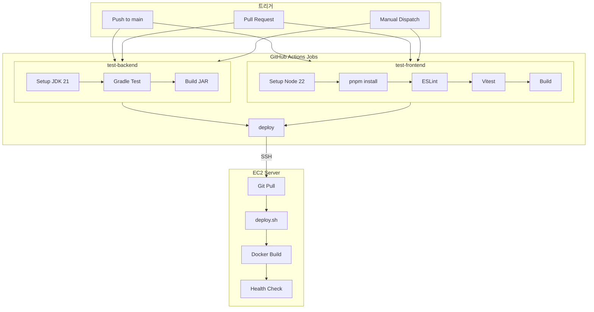
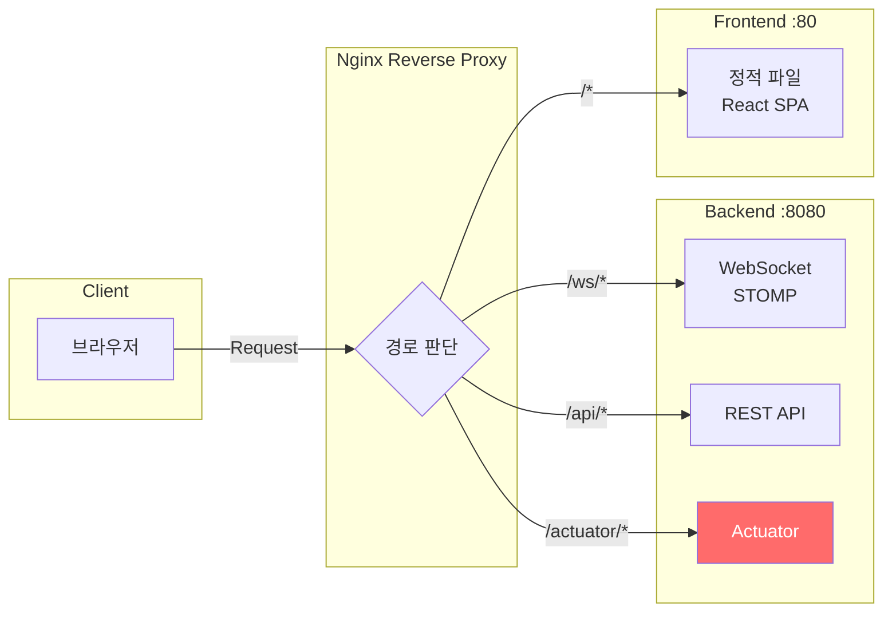
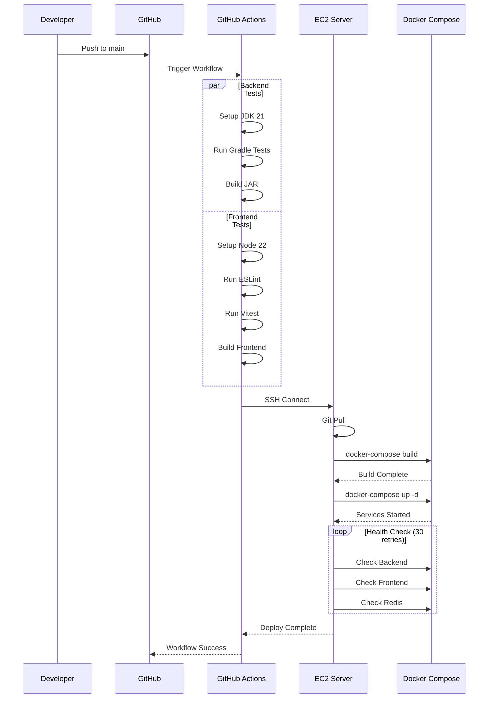
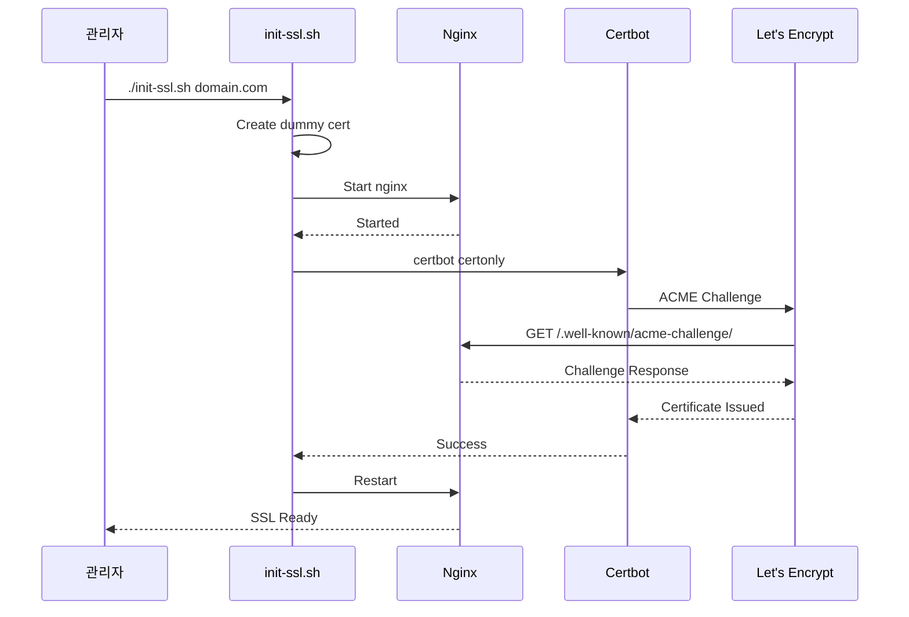
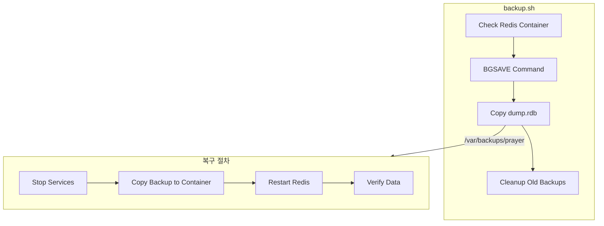
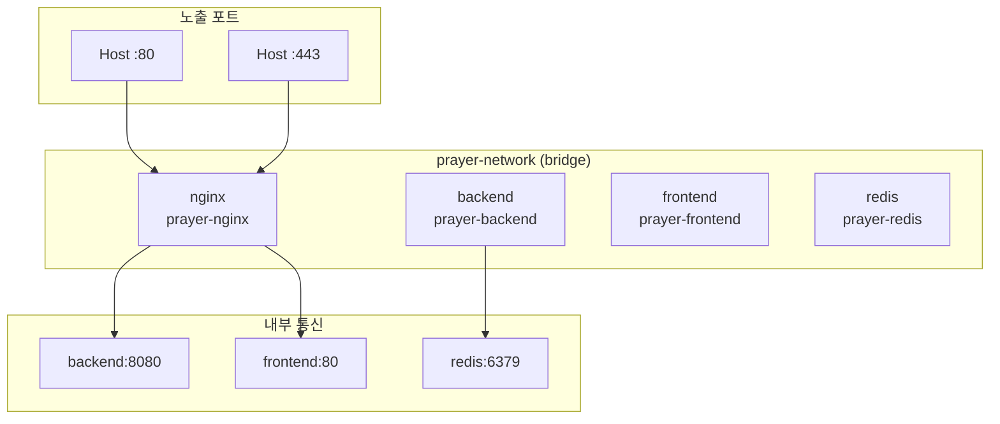

# Phase 7: 배포 아키텍처 다이어그램

## 1. 프로덕션 인프라 구조

```mermaid
graph TB
    subgraph Internet
        User[사용자]
        GH[GitHub]
    end

    subgraph AWS["AWS EC2"]
        subgraph Docker["Docker Compose"]
            Nginx[Nginx<br/>:80/:443]
            Certbot[Certbot<br/>SSL 갱신]
            Backend[Backend<br/>:8080]
            Frontend[Frontend<br/>:80]
            Redis[Redis<br/>:6379]
        end
    end

    subgraph External["외부 서비스"]
        Binance[Binance<br/>WebSocket]
    end

    User -->|HTTPS| Nginx
    GH -->|SSH Deploy| Docker
    Nginx -->|/ws| Backend
    Nginx -->|/api| Backend
    Nginx -->|/| Frontend
    Backend --> Redis
    Backend --> Binance
    Certbot -.->|인증서| Nginx
```

## 2. Docker 서비스 의존성

```mermaid
graph LR
    subgraph Services
        N[nginx]
        C[certbot]
        B[backend]
        F[frontend]
        R[redis]
    end

    N -->|depends_on| B
    N -->|depends_on| F
    B -->|depends_on<br/>service_healthy| R
    C -.->|volume| N
```

## 3. CI/CD 파이프라인

```mermaid
flowchart TD
    subgraph Trigger["트리거"]
        Push[Push to main]
        PR[Pull Request]
        Manual[Manual Dispatch]
    end

    subgraph Jobs["GitHub Actions Jobs"]
        subgraph TestBackend["test-backend"]
            JDK[Setup JDK 21]
            Gradle[Gradle Test]
            BuildJar[Build JAR]
        end

        subgraph TestFrontend["test-frontend"]
            Node[Setup Node 22]
            PNPM[pnpm install]
            Lint[ESLint]
            Test[Vitest]
            BuildFE[Build]
        end

        Deploy[deploy]
    end

    subgraph Server["EC2 Server"]
        GitPull[Git Pull]
        DeployScript[deploy.sh]
        DockerBuild[Docker Build]
        HealthCheck[Health Check]
    end

    Push --> TestBackend
    Push --> TestFrontend
    PR --> TestBackend
    PR --> TestFrontend
    Manual --> TestBackend
    Manual --> TestFrontend

    JDK --> Gradle --> BuildJar
    Node --> PNPM --> Lint --> Test --> BuildFE

    TestBackend --> Deploy
    TestFrontend --> Deploy

    Deploy -->|SSH| GitPull
    GitPull --> DeployScript
    DeployScript --> DockerBuild
    DockerBuild --> HealthCheck
```

## 4. Nginx 요청 라우팅

```mermaid
flowchart LR
    subgraph Client
        Browser[브라우저]
    end

    subgraph Nginx["Nginx Reverse Proxy"]
        Router{경로 판단}
    end

    subgraph Backend["Backend :8080"]
        WS[WebSocket<br/>STOMP]
        API[REST API]
        Actuator[Actuator]
    end

    subgraph Frontend["Frontend :80"]
        Static[정적 파일<br/>React SPA]
    end

    Browser -->|Request| Router
    Router -->|/ws/*| WS
    Router -->|/api/*| API
    Router -->|/actuator/*| Actuator
    Router -->|/*| Static

    style Actuator fill:#ff6b6b,color:#fff
```

## 5. 배포 프로세스 시퀀스

```mermaid
sequenceDiagram
    participant Dev as Developer
    participant GH as GitHub
    participant CI as GitHub Actions
    participant EC2 as EC2 Server
    participant Docker as Docker Compose

    Dev->>GH: Push to main
    GH->>CI: Trigger Workflow

    par Backend Tests
        CI->>CI: Setup JDK 21
        CI->>CI: Run Gradle Tests
        CI->>CI: Build JAR
    and Frontend Tests
        CI->>CI: Setup Node 22
        CI->>CI: Run ESLint
        CI->>CI: Run Vitest
        CI->>CI: Build Frontend
    end

    CI->>EC2: SSH Connect
    EC2->>EC2: Git Pull
    EC2->>Docker: docker-compose build
    Docker-->>EC2: Build Complete
    EC2->>Docker: docker-compose up -d
    Docker-->>EC2: Services Started

    loop Health Check (30 retries)
        EC2->>Docker: Check Backend
        EC2->>Docker: Check Frontend
        EC2->>Docker: Check Redis
    end

    EC2-->>CI: Deploy Complete
    CI-->>GH: Workflow Success
```

## 6. SSL 인증서 발급 프로세스

```mermaid
sequenceDiagram
    participant Admin as 관리자
    participant Script as init-ssl.sh
    participant Nginx as Nginx
    participant Certbot as Certbot
    participant LE as Let's Encrypt

    Admin->>Script: ./init-ssl.sh domain.com
    Script->>Script: Create dummy cert
    Script->>Nginx: Start nginx
    Nginx-->>Script: Started
    Script->>Certbot: certbot certonly
    Certbot->>LE: ACME Challenge
    LE->>Nginx: GET /.well-known/acme-challenge/
    Nginx-->>LE: Challenge Response
    LE-->>Certbot: Certificate Issued
    Certbot-->>Script: Success
    Script->>Nginx: Restart
    Nginx-->>Admin: SSL Ready
```

## 7. 백업 및 복구

```mermaid
flowchart TD
    subgraph Backup["backup.sh"]
        B1[Check Redis Container]
        B2[BGSAVE Command]
        B3[Copy dump.rdb]
        B4[Cleanup Old Backups]
    end

    subgraph Restore["복구 절차"]
        R1[Stop Services]
        R2[Copy Backup to Container]
        R3[Restart Redis]
        R4[Verify Data]
    end

    B1 --> B2 --> B3 --> B4
    R1 --> R2 --> R3 --> R4

    B3 -->|/var/backups/prayer| Restore
```

## 8. 컨테이너 네트워크

```mermaid
graph TB
    subgraph prayer-network["prayer-network (bridge)"]
        N[nginx<br/>prayer-nginx]
        B[backend<br/>prayer-backend]
        F[frontend<br/>prayer-frontend]
        R[redis<br/>prayer-redis]
    end

    subgraph Ports["노출 포트"]
        P80[Host :80]
        P443[Host :443]
    end

    subgraph Internal["내부 통신"]
        IB[backend:8080]
        IF[frontend:80]
        IR[redis:6379]
    end

    P80 --> N
    P443 --> N
    N --> IB
    N --> IF
    B --> IR
```
